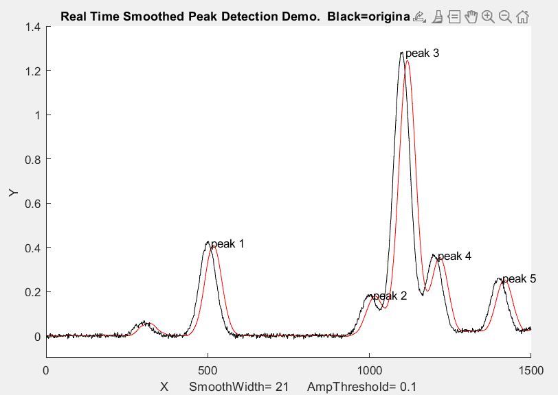

<h1>Real Time Signal Processing Demo</h1>

Real time analysis of EEG data requires near-instaneous detection of peaks and trough (less than ~5ms lag). Thus, we are unable to rely on noncausal techniques such as the Hilbert transform. 

<h2>Process</h2>
In this demo, a real-time signal is simulated by using a preloaded dataset and then accessing it point by point.
<ol>
  <li>A peak (or trough) that rise or fall below the set amplitude threshold are located. </li>
  <li>A least-squares curve-fit of a Gaussian function is applied to the top of the peak.</li>
  <li>Estimated position, height, and width of each peak is calculated.</li>
  <li>If "drawnow" is enabled, graphing and labeling of each peak is performed at the end of the code.</li>
</ol>

<h2>Usage</h2>
<ul>
  <li>You are able substitute real-time sensor data instead of a dataset.</li>
  <li>Although there are no troughs seen in the dataset shown, this code should work for trough detection.</li>
  <li>You can adjust the amplitude threshold by changing the value of AmpThreshold in the code</li>
  <li>Uncomment "drawnow" at the end of the code if you wish to view graphing in real time. However, this will significantly impact performance.</li>
</ul>

 

</img>
